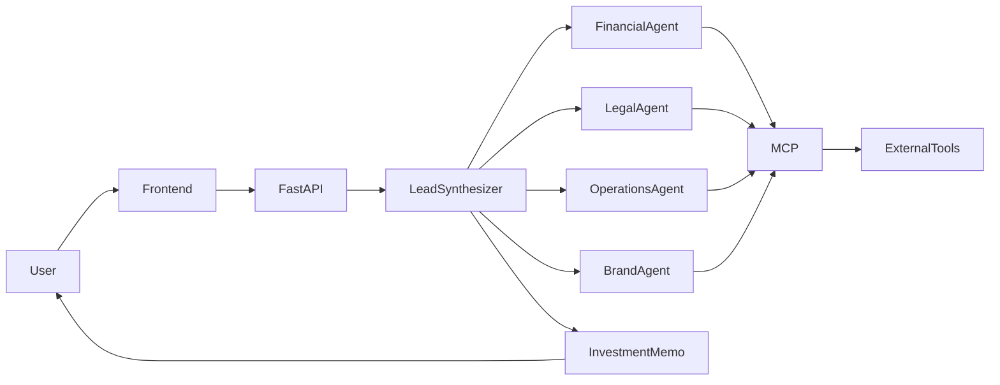

<div align="center">

# 🧠 VYC — Automated M&A Due Diligence Swarm

### Enterprise Multi-Agent AI Platform for Intelligent Mergers & Acquisitions

Built with **Google Agent Development Kit (ADK)**, **Gemini**, **Model Context Protocol (MCP)**, **FastAPI**, and **React**.


Developed for the **Google x Kaggle AI Agents: Intensive Vibe Coding Capstone Project**

</div>

---

# 📖 Overview

VYC (Vibes Your Code) is a production-oriented Multi-Agent AI platform that automates **Mergers & Acquisitions (M&A) Due Diligence**.

Instead of relying on a single LLM, VYC coordinates multiple specialized AI agents that collaborate to analyze financial, legal, operational, and market information before generating an executive investment recommendation.

The platform demonstrates Google's AI Agent ecosystem through **ADK**, **MCP**, secure tool execution, and Human-in-the-Loop workflows.

---

# 🎯 Problem Statement

Traditional M&A due diligence is expensive, time-consuming, and heavily dependent on manual analysis performed by financial analysts, legal consultants, and operational experts.

Organizations must review large volumes of financial statements, contracts, operational documents, and market information before making investment decisions.

VYC aims to reduce manual effort by enabling multiple AI agents to collaborate on different aspects of due diligence while keeping humans in control of critical decisions.

---

# 💡 Our Solution

VYC adopts a **Multi-Agent Swarm Architecture** where each agent focuses on a single business domain.

A Lead Synthesizer orchestrates the workflow, distributes tasks, aggregates results, and generates a final Investment Memo.

This approach provides:

- Parallel analysis
- Modular AI agents
- Explainable reasoning
- Secure tool execution
- Human oversight

---

# ✨ Key Features

- 🤖 Multi-Agent Collaboration
- 🧠 Google Agent Development Kit (ADK)
- 🔗 Model Context Protocol (MCP)
- 👤 Human-in-the-Loop (HITL)
- 🛡 Secure Tool Execution
- 📄 Automated Investment Memo
- ⚡ Parallel Agent Execution
- 🚀 Production-Ready Architecture
- 🐳 Docker Support
- ☁ Railway Deployment

---

# 🏗 System Architecture



### Workflow

1. User submits an acquisition request.
2. Lead Synthesizer creates an execution plan.
3. Specialized agents perform parallel analysis.
4. Agents retrieve external information through MCP.
5. Results are aggregated.
6. Human approval is requested if required.
7. Investment Memo is generated.

---

# 🤖 AI Agents

| Agent | Responsibility |
|-------|----------------|
| 👑 Lead Synthesizer | Orchestrates the complete workflow |
| 💰 Financial Agent | Financial statement analysis |
| ⚖ Legal Agent | Contract & compliance review |
| 🏭 Operations Agent | Operational assessment |
| 📈 Brand Agent | Market & reputation analysis |

---

# ⚙ Tech Stack

| Category | Technology |
|----------|------------|
| AI Framework | Google ADK |
| LLM | Gemini |
| Tool Integration | MCP |
| Backend | FastAPI |
| Frontend | React + Vite |
| Database | SQLite |
| Deployment | Docker + Railway |
| Language | Python |

---

# 🧩 Kaggle Concepts Implementation

| Concept | Implementation |
|----------|----------------|
| Agent / Multi-Agent | Specialized collaborative agents |
| ADK | Lead Synthesizer orchestration |
| MCP Server | External tool integrations |
| Security Features | Sandbox, policy validation, HITL |
| Deployability | Docker & Railway deployment |
| Agent Skills | Modular agent capabilities |

---

# 🚀 Quick Start

## Clone Repository

```bash
git clone https://github.com/halimamrin312/VYC-Vibes-Your-Code.git

cd VYC-Vibes-Your-Code
```

## Backend

```bash
python -m venv venv

source venv/bin/activate

pip install -r requirements.txt
```

## Frontend

```bash
cd frontend

npm install

npm run dev
```

## Environment Variables

```env
GEMINI_API_KEY=YOUR_API_KEY
COURTLISTENER_API_TOKEN=YOUR_TOKEN
```

## Run

```bash
docker compose up --build
```

or

```bash
uvicorn backend.app.main:app --reload
```

---

# 🎥 Video Demonstration

> **Coming Soon**

The demo will showcase:

- Multi-Agent workflow
- MCP integrations
- Human-in-the-Loop
- Investment Memo generation
- End-to-end application flow

📺 **YouTube**

```
Add YouTube link here
```

---

# 👥 Contributors

| Name | GitHub |
|------|--------|
| Muhammad Halim Amrin | https://github.com/halimamrin312 |
| Murtuza Ali | https://github.com/murtuza-alii |
| Abdulwaliyi | https://github.com/Abdulwaliyi007 |

---

# 🌐 Deployment

**Live Application**

https://swarm-ai-production.up.railway.app/

**GitHub Repository**

https://github.com/halimamrin312/VYC-Vibes-Your-Code

---

# 📄 License

This project is licensed under the **MIT License**.

---

<div align="center">

**VYC – Vibes Your Code**

Enterprise Multi-Agent AI Platform for Intelligent M&A Due Diligence

Built with ❤️ using Google ADK, Anti Gravity, Gemini, MCP, FastAPI, React, and Railway.

</div>
