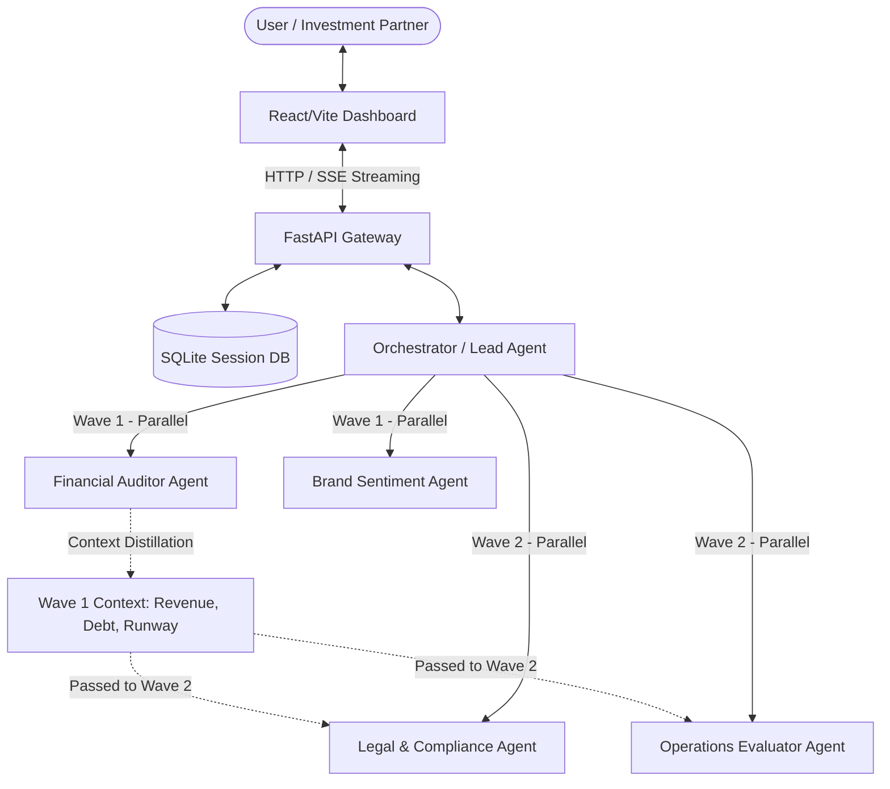

# M&A Due Diligence Swarm Platform

An automated, multi-agent due diligence platform for Mergers & Acquisitions (M&A). The system coordinates specialized agents to analyze target financials, legal contracts, market sentiment, and operational efficiency using the **Google Agent Development Kit (ADK)** and the **Model Context Protocol (MCP)**.

---

## 🚀 Key Features

* **Multi-Agent Orchestration (2-Wave Execution):** Coordinates parallel agent executions (Wave 1: Financial & Sentiment; Wave 2: Legal & Operations) with dynamic context propagation.
* **Human-in-the-Loop (HITL) Checkpoints:** Automatically pauses the swarm and prompts the user for strategic decisions when critical risks (Severity 1) or missing data are detected.
* **Secure Script Execution Sandbox:** Executes agent-written code safely in an isolated subprocess sandbox with AST-based import/function gating and path-traversal validation.
* **Semantic Legal Contract RAG:** Ingests legal agreements, chunks them, and builds a local FAISS vector index to run 10 targeted legal risk queries (LQ-01 to LQ-10).
* **Model Context Protocol (MCP):** Connects agents directly to public regulatory databases (such as SEC EDGAR Search) using stdio-based JSON-RPC tools.
* **Interactive Control Dashboard:** Features a modern, glassmorphic UI built with React/Vite and lucide-icons, displaying log streams, ESI/CSI graphs, and generated memos.

---

## 🧠 Core Concepts Covered

The platform is designed around five main concepts, and each one is implemented in a concrete way inside the repository.

### 1. Agent / Multi-Agent System (ADK)
The orchestration layer is implemented in [swarm/orchestrator.py](swarm/orchestrator.py). It uses a central orchestrator, a dynamic agent registry, and automatic discovery of agent modules so new specialist agents can be loaded without hardcoding every integration. The orchestrator keeps session state, routes work between agents, and supports Human-in-the-Loop pauses when the workflow needs human approval. Specialized agents live in [swarm/agents](swarm/agents) and are responsible for distinct tasks such as financial review, legal analysis, operations evaluation, and brand sentiment analysis.

### 2. MCP Server Integration
The system includes an MCP-style server implementation in [mcp_servers/edgar_mcp/server.py](mcp_servers/edgar_mcp/server.py). This server exposes tools such as company lookup, financial fact retrieval, and filing discovery, and it speaks over stdio JSON-RPC so that agent workflows can invoke external tools in a structured manner. In practice, the financial agent calls these tools to gather SEC-oriented context before generating its findings.

### 3. Security Features
Security is implemented as a layered runtime protection model. [security/sandbox.py](security/sandbox.py) runs agent-generated scripts inside an isolated subprocess with a timeout and a temporary scratch workspace. [security/policy_engine.py](security/policy_engine.py) validates code structure with AST-based import checks, blocks dangerous commands, and restricts file writes to an allowlisted directory set. [security/identity.py](security/identity.py) adds a human-readable safety review layer so sensitive actions can be surfaced for explicit confirmation.

### 4. Deployability
The backend is exposed through [backend/app/main.py](backend/app/main.py), which starts a FastAPI application, registers the core routers, and serves the API for the frontend. The deployment path is also prepared through [Procfile](Procfile) for platform hosting, [frontend/package.json](frontend/package.json) for the Vite frontend build and preview scripts, and [docker-compose.yml](docker-compose.yml) for container-based orchestration. This makes the platform suitable for both local development and hosted deployment.

### 5. Agent Skills / Agents CLI Workflow
The repository follows a skill-oriented structure by organizing behavior into reusable agent modules, prompt templates, and tool adapters. The prompt layer lives in [swarm/prompt_templates](swarm/prompt_templates), while agent behavior is modularized under [swarm/agents](swarm/agents). This design makes it straightforward to add a new specialist skill, register it with the orchestrator, and expose the same workflow through a future CLI-style interface or additional tooling layer.

---

## 📂 Project Architecture



---

## 🛠️ Technology Stack

* **Backend:** FastAPI (Python 3.14+), Uvicorn, Peewee ORM (SQLite).
* **Frontend:** React 18, Vite, Lucide React, CSS Glassmorphism.
* **Agent Engine:** Google Agent Development Kit (ADK), Custom Registry Patterns.
* **Security:** Python AST (Abstract Syntax Trees), Subprocess Sandboxing.
* **Vector Store:** FAISS (Facebook AI Similarity Search) and SentenceTransformers.

---

## ⚡ Quick Start

### Prerequisites
* Python 3.14+
* Node.js & npm

### 1. Configuration Setup
Create a `.env` file in the project root:
```properties
GEMINI_API_KEY="your_gemini_api_key"
COURTLISTENER_API_TOKEN="optional_courtlistener_token"
GOVINFO_API_KEY="optional_govinfo_key"
```

### 2. Start the Backend API Server
```bash
# Activate virtual environment
source venv/bin/activate

# Start Uvicorn reload server
uvicorn backend.app.main:app --host 0.0.0.0 --port 8000 --reload
```

### 3. Start the Frontend Dev Server
In a new terminal window:
```bash
cd frontend
npm install
npm run dev
```
Open **[http://localhost:3000/](http://localhost:3000/)** in your web browser.

---

## 🧪 Testing the Swarm

Verify code compliance, security policies, and agent mechanics:

* **Run all tests:**
  ```bash
  venv/bin/pytest -v
  ```
* **Interactive Scenarios on the Dashboard:**
  * **Public Flow (Auto):** Set target company to `TSLA` or `AAPL` and dispatch. It pulls financial metrics automatically via yfinance/SEC.
  * **Private Flow (HITL):** Set target company to `Acme Corp` and dispatch. The system will pause and ask you to upload a financial CSV file in the Data Room tab.
  * **Legal Warning (HITL):** Set target company to `Cyberdyne Systems` and dispatch. It will pause on Wave 2 to alert you about an active lawsuit from CourtListener.
