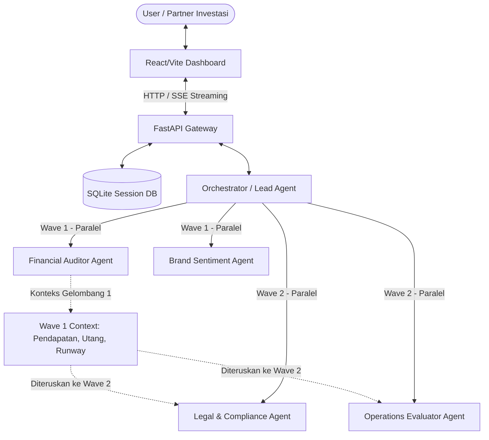

# Platform Swarm Uji Tuntas M&A (M&A Due Diligence Swarm Platform)

Sebuah platform uji tuntas (*due diligence*) otomatis untuk aktivitas Merger & Akuisisi (M&A). Sistem ini mengoordinasikan agen-agen cerdas untuk menganalisis kesehatan keuangan, kontrak hukum, sentimen pasar, dan efisiensi operasional target perusahaan menggunakan **Google Agent Development Kit (ADK)** dan **Model Context Protocol (MCP)**.

---

## 🚀 Fitur Utama

* **Multi-Agent Orchestration (2-Wave Execution):** Mengoordinasikan eksekusi agen secara paralel (Wave 1: Keuangan & Sentimen; Wave 2: Hukum & Operasional) dengan transfer konteks otomatis antar-gelombang.
* **Human-in-the-Loop (HITL) Checkpoints:** Menghentikan sementara swarm secara otomatis dan meminta arahan strategis dari pengguna ketika mendeteksi risiko kritis (Severity 1) atau data keuangan swasta yang kurang.
* **Sandbox Eksekusi Kode Aman:** Mengeksekusi kode analisis Python yang ditulis oleh agen di dalam subprocess terisolasi dengan penyaringan impor modul berbasis AST dan proteksi *path-traversal*.
* **Semantic Legal RAG:** Mengindeks dokumen kontrak hukum PDF ke FAISS Vector Store lokal dan menjalankan 10 kueri pencarian risiko hukum spesifik (LQ-01 hingga LQ-10).
* **Model Context Protocol (MCP):** Menghubungkan agen secara terstruktur ke API regulator publik (seperti SEC EDGAR Search) menggunakan komunikasi stdio JSON-RPC.
* **Dashboard Kontrol Interaktif:** Antarmuka visual modern berbasis React/Vite dengan desain *glassmorphism* untuk memantau status agen, log streaming, grafik CSI/ESI, dan laporan memo investasi.

---

## 🧠 Konsep Kunci yang Dicakup

Platform ini dirancang di sekitar lima konsep utama, dan setiap konsep diimplementasikan secara konkret di dalam repository.

### 1. Agent / Multi-Agent System (ADK)
Lapisan orkestrasi diimplementasikan di [swarm/orchestrator.py](swarm/orchestrator.py). Sistem ini memakai orchestrator pusat, registri agen dinamis, dan pendeteksian modul agen otomatis sehingga agen spesialis baru dapat dimuat tanpa hardcoding setiap integrasi. Orchestrator juga menjaga state sesi, mengarahkan pekerjaan antar agen, dan mendukung jeda Human-in-the-Loop saat alur kerja memerlukan persetujuan manusia. Agen spesialis berada di [swarm/agents](swarm/agents) dan bertanggung jawab atas tugas seperti review keuangan, analisis hukum, evaluasi operasi, serta analisis sentimen merek.

### 2. Integrasi MCP Server
Sistem ini memiliki implementasi server berjenis MCP di [mcp_servers/edgar_mcp/server.py](mcp_servers/edgar_mcp/server.py). Server ini mengekspor alat seperti pencarian perusahaan, pengambilan fakta finansial, dan pencarian dokumen filing, lalu berkomunikasi melalui stdio JSON-RPC agar alur agen dapat memanggil alat eksternal secara terstruktur. Dalam praktiknya, agen finansial memanggil alat-alat ini untuk mengumpulkan konteks berbasis SEC sebelum menghasilkan temuan.

### 3. Fitur Keamanan
Keamanan diimplementasikan sebagai lapisan perlindungan runtime yang bertingkat. [security/sandbox.py](security/sandbox.py) menjalankan skrip yang dibuat agen di dalam subprocess terisolasi dengan batas waktu dan ruang kerja sementara. [security/policy_engine.py](security/policy_engine.py) memvalidasi struktur kode menggunakan pemeriksaan impor berbasis AST, memblokir perintah berbahaya, dan membatasi penulisan file ke jalur yang diizinkan. [security/identity.py](security/identity.py) menambahkan lapisan review aman yang dapat dibaca manusia agar aksi sensitif dapat disajikan untuk persetujuan eksplisit.

### 4. Deployability
Backend diekspos melalui [backend/app/main.py](backend/app/main.py), yang menjalankan aplikasi FastAPI, mendaftarkan router utama, dan melayani API untuk frontend. Jalur deployment juga sudah dipersiapkan melalui [Procfile](Procfile) untuk hosting platform, [frontend/package.json](frontend/package.json) untuk build dan preview frontend Vite, serta [docker-compose.yml](docker-compose.yml) untuk orkestrasi berbasis kontainer. Hal ini membuat platform cocok untuk pengembangan lokal maupun deployment terhosting.

### 5. Agent Skills / Workflow Agents CLI
Repository ini mengikuti struktur berorientasi skill dengan mengorganisasikan perilaku ke dalam modul agen yang dapat digunakan ulang, template prompt, dan adaptor alat. Lapisan prompt berada di [swarm/prompt_templates](swarm/prompt_templates), sementara perilaku agen termodularisasi di [swarm/agents](swarm/agents). Desain ini memudahkan penambahan skill spesialis baru, pendaftaran ke orchestrator, dan pemaparan alur kerja yang sama melalui antarmuka CLI-style di masa depan.

---

## 📂 Arsitektur Proyek



---

## 🛠️ Komponen Teknologi

* **Backend:** FastAPI (Python 3.14+), Uvicorn, Peewee ORM (SQLite).
* **Frontend:** React 18, Vite, Lucide React, CSS Glassmorphism.
* **Agent Engine:** Google Agent Development Kit (ADK), Pola Registry Kustom.
* **Keamanan:** Python AST (Abstract Syntax Trees), Subprocess Sandboxing.
* **Vector Store:** FAISS (Facebook AI Similarity Search) & SentenceTransformers.

---

## ⚡ Panduan Memulai Cepat

### Prasyarat
* Python 3.14+
* Node.js & npm

### 1. Konfigurasi Lingkungan
Buat file `.env` di direktori utama proyek:
```properties
GEMINI_API_KEY="api_key_gemini_anda"
COURTLISTENER_API_TOKEN="token_courtlistener_opsional"
GOVINFO_API_KEY="key_govinfo_opsional"
```

### 2. Jalankan Server API Backend
```bash
# Aktifkan virtual environment
source venv/bin/activate

# Jalankan server backend uvicorn
uvicorn backend.app.main:app --host 0.0.0.0 --port 8000 --reload
```

### 3. Jalankan Server Frontend Vite
Buka terminal baru di direktori utama proyek:
```bash
cd frontend
npm install
npm run dev
```
Buka alamat **[http://localhost:3000/](http://localhost:3000/)** di browser Anda.

---

## 🧪 Menguji Sistem Swarm

Memverifikasi integritas sistem, aturan keamanan, dan fungsi multi-agent:

* **Jalankan Pengujian Unit Otomatis:**
  ```bash
  venv/bin/pytest -v
  ```
* **Skenario Pengujian pada Dashboard:**
  * **Alur Publik (Otomatis):** Set nama perusahaan target ke **`TSLA`** atau **`AAPL`** dan klik *Dispatch*. Sistem akan menarik laporan keuangan secara otomatis dari SEC/yfinance.
  * **Alur Swasta (HITL):** Set nama perusahaan target ke **`Acme Corp`** dan klik *Dispatch*. Swarm akan dijeda otomatis dan meminta Anda mengunggah file keuangan sampel `.csv` di tab Data Room.
  * **Peringatan Hukum (HITL):** Set nama perusahaan target ke **`Cyberdyne Systems`** dan klik *Dispatch*. Swarm akan dijeda di Wave 2 untuk memunculkan red flag kasus hukum aktif dari CourtListener.
