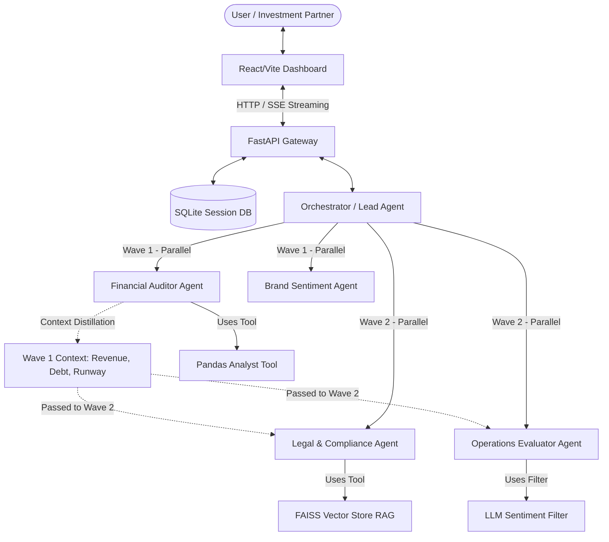

# Analisis Project: M&A Due Diligence Swarm

Project ini adalah **Multi-Agent Swarm** yang dirancang untuk mengotomatisasi proses *due diligence* (uji tuntas) Merger & Akuisisi (M&A). Sistem ini menganalisis kesehatan keuangan, aspek hukum, sentimen pasar, dan efisiensi operasional dari target perusahaan menggunakan Google Agent Development Kit (ADK) dan Model Context Protocol (MCP).

---

## 1. Arsitektur Swarm & Alur Kerja

Sistem ini dirancang dengan arsitektur dua gelombang (*2-wave execution flow*) yang dikoordinasikan oleh **Lead Synthesizer Agent (Orchestrator)**. 

### Diagram Arsitektur Swarm

---

## 2. Peta Direktori & Deskripsi Komponen

Berikut adalah struktur utama direktori dan fungsinya:

| Direktori/File | Deskripsi | Link File |
| :--- | :--- | :--- |
| `backend/` | API Gateway menggunakan FastAPI. Mengatur CORS, database session, endpoint upload data room, dan SSE chat stream. | [main.py](file:///home/tdr1000/documents/VYC-Vibes-Your-Code/backend/app/main.py) |
| `frontend/` | Dashboard interaktif menggunakan React/Vite. Menampilkan data room upload, chat window, visualisasi CSI/ESI, dan memo investasi. | [App.jsx](file:///home/tdr1000/documents/VYC-Vibes-Your-Code/frontend/src/App.jsx) |
| `swarm/` | Logika inti multi-agent (ADK). Terdiri dari sub-agent, template prompt, dan custom tools. | [orchestrator.py](file:///home/tdr1000/documents/VYC-Vibes-Your-Code/swarm/orchestrator.py) |
| `security/` | Layer keamanan yang membatasi impor modul python di sandbox, sanitasi teks (zero-width characters), dan sandbox subprocess. | [policy_engine.py](file:///home/tdr1000/documents/VYC-Vibes-Your-Code/security/policy_engine.py) |
| `mcp_servers/` | Server Model Context Protocol (SEC EDGAR, CourtListener, FileSystem) untuk menghubungkan agent dengan database publik & file lokal. | [server.py](file:///home/tdr1000/documents/VYC-Vibes-Your-Code/mcp_servers/edgar_mcp/server.py) |
| `tests/` | Unit testing menggunakan `pytest`. | [test_financial.py](file:///home/tdr1000/documents/VYC-Vibes-Your-Code/tests/test_financial.py) |

---

## 3. Detail Sub-Agent

1. **Financial Auditor Agent** ([financial_auditor.py](file:///home/tdr1000/documents/VYC-Vibes-Your-Code/swarm/agents/financial_auditor.py))
   - Mengklasifikasikan perusahaan (Publik vs Swasta).
   - Menjalankan analisis rasio (*debt-to-equity*, *EBITDA margin*, *runway*) menggunakan script Pandas yang diisolasi di sandbox.
   - Memicu status **PAUSED (HITL)** jika data perusahaan swasta tidak lengkap sehingga user harus mengupload laporan keuangan CSV secara manual.
2. **Operations Evaluator Agent** ([ops_evaluator.py](file:///home/tdr1000/documents/VYC-Vibes-Your-Code/swarm/agents/ops_evaluator.py))
   - Menganalisis ulasan pelanggan dan karyawan.
   - Menghitung **Customer Support Index (CSI)** dan **Employee Sentiment Index (ESI)**. Menggunakan LLM untuk mengklasifikasikan ulasan ambigu (Rating 3).
3. **Legal & Compliance Agent** ([legal_compliance.py](file:///home/tdr1000/documents/VYC-Vibes-Your-Code/swarm/agents/legal_compliance.py))
   - Memindai dokumen kontrak menggunakan RAG lokal (FAISS) untuk mendeteksi klausul berisiko (*poison pill*, *golden parachute*).
   - Mengintegrasikan CourtListener untuk mendeteksi tuntutan hukum aktif.
4. **Brand & Sentiment Agent** ([brand_sentiment.py](file:///home/tdr1000/documents/VYC-Vibes-Your-Code/swarm/agents/brand_sentiment.py))
   - Mengumpulkan data sentimen publik dari berita dan ulasan produk.

---

### 4. Hasil Analisis Masalah & Bugs Kritis (SEMUA SUDAH DIPERBAIKI)

Semua masalah kritis dan kegagalan unit test sebelumnya kini telah **berhasil diperbaiki** dan diverifikasi melalui pytest:

### Bug 1: Kesalahan Penggabungan Kode (TERSELESAIKAN)
- **Status:** Perbaikan Selesai.
- **Tindakan:** Kode penuh Legal & Compliance Agent ([legal_compliance.py](file:///home/tdr1000/documents/VYC-Vibes-Your-Code/swarm/agents/legal_compliance.py)) dan endpoint `/api/ingest/legal` di [ingest.py](file:///home/tdr1000/documents/VYC-Vibes-Your-Code/backend/app/routers/ingest.py) telah dikembalikan dari `abdul-branch`.

### Bug 2: Eksekusi Python Sandbox di Linux (TERSELESAIKAN)
- **Status:** Perbaikan Selesai.
- **Tindakan:** Mengubah literal `"python"` di [sandbox.py](file:///home/tdr1000/documents/VYC-Vibes-Your-Code/security/sandbox.py) menjadi `sys.executable` agar subprocess mengeksekusi python dari *virtual environment* yang aktif secara dinamis.

### Bug 3: Pengujian Klasifikasi Perusahaan yang Flaky (TERSELESAIKAN)
- **Status:** Perbaikan Selesai.
- **Tindakan:** Menggunakan mock `monkeypatch` di [test_financial.py](file:///home/tdr1000/documents/VYC-Vibes-Your-Code/tests/test_financial.py) untuk memastikan evaluasi klasifikasi perusahaan berjalan terisolasi dari live LLM secara offline.

### Brand Sentiment Agent Skeleton (TERSELESAIKAN)
- **Status:** Fungsional Penuh.
- **Tindakan:** Mengimplementasikan kelas `BrandSentiment` secara utuh untuk mendukung kueri sanitizer, kalkulasi BHI, *ingestion* CSV ulasan konsumen lokal dengan pemetaan kolom dinamis, dan integrasi synthesis LLM dengan *fallback* markdown terstruktur.

---

## 5. Rekomendasi Langkah Selanjutnya

1. **Memperbaiki Jalur Folder Sandbox:** Mengubah konfigurasi folder keras Windows (`d:/kaggle capstone project/...`) di [sandbox.py](file:///home/tdr1000/documents/VYC-Vibes-Your-Code/security/sandbox.py) dan [security_config.yaml](file:///home/tdr1000/documents/VYC-Vibes-Your-Code/security/security_config.yaml) ke sistem *environment variable* atau jalur relatif proyek agar lebih portabel.
2. **Koneksi API Sentimen & Legal Riil:** Menghubungkan client simulator (seperti CourtListener, GovInfo, dan Companies House) ke layanan API asli (dengan API token/key) ketika sistem dipersiapkan masuk ke fase *production*.

---

## 6. Deep Dive Aspek Teknis (ADK, MCP, Security, dan Agent Skills)

Berikut adalah hasil analisis mendalam terhadap empat aspek teknis utama proyek:

### A. Agent / Multi-Agent System (ADK)
* **Pola Dynamic Registry:** Proyek ini menggunakan `@register_agent("name")` untuk mendaftarkan sub-agent ke registry global secara dinamis. Metode ini sangat efektif karena mendekopel `orchestrator.py` dari kode sub-agent, mengurangi risiko konflik penggabungan (*git merge conflict*) pada tim pengembang.
* **Mekanisme 2-Wave Execution:** Orchestrator mengoordinasikan sub-agent secara bertahap menggunakan thread pool:
  - **Wave 1 (Auditor & Sentimen):** Menghasilkan laporan metrik finansial kuantitatif (pendapatan, rasio utang, landasan kas) dan data sentimen pasar kasar.
  - **Wave 2 (Hukum & Operasional):** Berjalan dengan menerima context terdistilasi dari Wave 1. Sebagai contoh, Legal Compliance Agent secara otomatis meninjau defaults risiko hukum dan default covenants jika rasio utang target di Wave 1 dinilai kritis (> 2.0).
* **HITL Checkpoints & State Persistence:** Saat agen mendeteksi anomali kritis (misal: rasio keuangan kritis, temuan hukum Severity 1, atau hilangnya berkas keuangan swasta), sistem memicu jeda strategis (`hitl_status = "PAUSED"`). State sesi lengkap (termasuk riwayat obrolan dan draf laporan sementara) diserialisasikan ke database SQLite melalui Peewee ORM dan file JSON lokal. Swarm dapat dilanjutkan secara mulus setelah human memberikan arahan/keputusan.

### B. MCP Server (Model Context Protocol)
* **Arsitektur Stdio JSON-RPC:** Terletak di direktori `mcp_servers/`, server MCP dirancang berbasis stdio standar yang mematuhi protokol MCP (versi `2024-11-05`).
* **SEC EDGAR MCP (`edgar_mcp`):** 
  - Mengekspos alat `search_company`, `get_financials`, dan `get_filings`.
  - Mengirim kueri HTTP langsung ke REST API SEC dengan headers `User-Agent` deklaratif (sesuai kebijakan SEC).
  - Menyediakan `MOCK_DATABASE` internal deterministik sebagai fallback untuk menangani batas kuota (*rate limiting*) atau status offline selama pengujian.
* **RAG & File System MCP:** Memungkinkan sub-agent memindai file room target secara terstruktur untuk pengindeksan dokumen hukum PDF ke FAISS Vector Database lokal.

### C. Security Features (Keamanan Sandbox & Sanitasi)
* **Sanitasi Konteks (Context Hygiene):** Kelas `ContextResolver` di [policy_engine.py](file:///home/tdr1000/documents/VYC-Vibes-Your-Code/security/policy_engine.py) menyaring masukan teks untuk menghapus karakter tak terlihat (seperti *zero-width spaces* `\u200B-\u200D` dan BOM `\uFEFF`) guna mencegah serangan *indirect prompt injection*. Ini juga mendeteksi dan menyamarkan variabel lingkungan sistem (`ENV_*`).
* **AST Structural Gating:** Sebelum menjalankan kode Pandas auditor, `ToolPolicyEngine` mem-parsing kode python ke dalam Abstract Syntax Tree (AST) untuk memastikan tidak ada impor modul luar yang dilarang (hanya mengizinkan `pandas`, `numpy`, `openpyxl`, `sys`, `json`, `math`, `re`) dan memblokir command berbahaya (`os.system`, `subprocess.Popen`, dll.).
* **Isolasi Subprocess & File Tree:** Script dieksekusi di `EphemeralSandbox` ([sandbox.py](file:///home/tdr1000/documents/VYC-Vibes-Your-Code/security/sandbox.py)) dalam subprocess terpisah menggunakan interpreter python yang valid (`sys.executable`) dengan batas waktu ketat 10 detik, serta memvalidasi jalur direktori target agar tidak melompat keluar dari allowlist (*path traversal protection*).

### D. Agent Skills (Metadata & Modul Instruksi)
* **Folder modular `.agents/skills/`:** Skill didefinisikan sebagai folder tersendiri (seperti [legal-compliance-agent](file:///home/tdr1000/documents/VYC-Vibes-Your-Code/.agents/skills/legal-compliance-agent)).
* **SKILL.md (Instruksi Peran):** Mengatur metadata frontmatter, target input/output, tabel kueri pencarian (LQ-01 s/d LQ-10), panduan severitas risiko (Severity 1 hingga 4), format keluaran laporan, dan batasan operasional (*constraints*).
* **Script & Reference Terintegrasi:** Folder skill dilengkapi dengan subfolder `scripts/` (misal skrip *chunking* PDF dan pembuatan vektor) serta `references/` (misal panduan pola klausul dan catatan hukum spesifik yurisdiksi) yang dibaca agen secara dinamis saat tingkat kepercayaan *semantic search* dinilai rendah.
