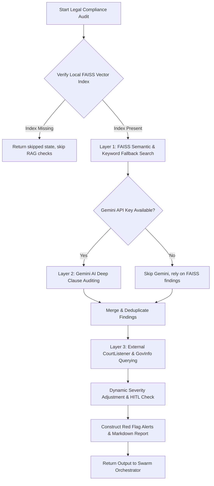

# Legal Compliance Agent - Detailed Technical Specification & Documentation

This document provides the complete, production-grade technical specification and documentation for the **Legal Compliance Agent** within the M&A Due Diligence Swarm. It has been updated to reflect the actual codebase implementation, covering local PDF text extraction, SentenceTransformer embeddings, FAISS storage indexing, Gemini AI clause analysis, external CourtListener & GovInfo integration, query sanitization, and the React frontend interface.

---

## 📂 Component Layout & File Locations

- **Main Agent Implementation:** [legal_compliance.py](file:///C:/Users/abdul/VYC-Vibes-Your-Code/swarm/agents/legal_compliance.py) — Defines the orchestrator lifecycle, 10 legal query metrics (LQ-01 to LQ-10), severity adjustment, and final report generation.
- **RAG & PDF Extraction Tool:** [local_pdf_parser.py](file:///C:/Users/abdul/VYC-Vibes-Your-Code/swarm/tools/local_pdf_parser.py) — Extracts text from private contracts, splits it into semantic chunks, and builds/queries the local FAISS index.
- **Data Sanitizer Tool:** [data_sanitizer.py](file:///C:/Users/abdul/VYC-Vibes-Your-Code/swarm/tools/data_sanitizer.py) — Scrubs outbound query metadata to prevent corporate leakage of transaction intent.
- **Gemini Clause Analyzer:** [gemini_clause_analyzer.py](file:///C:/Users/abdul/VYC-Vibes-Your-Code/swarm/tools/gemini_clause_analyzer.py) — Orchestrates LLM-based verification of document chunks via `gemini-2.5-flash`.
- **External API Clients:** [legal_api_clients.py](file:///C:/Users/abdul/VYC-Vibes-Your-Code/swarm/tools/legal_api_clients.py) — Integrates with CourtListener (dockets/litigation) and GovInfo (regulatory records) with mock fallback simulation capabilities.
- **System Prompt Template:** [legal_system.txt](file:///C:/Users/abdul/VYC-Vibes-Your-Code/swarm/prompt_templates/legal_system.txt) — Holds standard corporate counsel agent behavioral directives.
- **FastAPI Router:** [ingest.py](file:///C:/Users/abdul/VYC-Vibes-Your-Code/backend/app/routers/ingest.py) — Exposes `/api/ingest/legal` endpoint to receive PDF files, save them locally, and trigger vector ingestion.
- **Frontend Panel:** [LegalViewer.jsx](file:///C:/Users/abdul/VYC-Vibes-Your-Code/frontend/src/components/LegalViewer.jsx) & [LegalViewer.css](file:///C:/Users/abdul/VYC-Vibes-Your-Code/frontend/src/components/LegalViewer.css) — Implements drag-and-drop document upload, real-time audit visualization, risk metrics, dockets, and HITL alerts.
- **Testing Framework:** [test_legal.py](file:///C:/Users/abdul/VYC-Vibes-Your-Code/tests/test_legal.py) — Verifies chunk boundaries, agent execution pipeline, sanitization, mock API services, and Gemini parser functions.

---

## ⚙️ Architecture & Pipeline Overview

The [LegalCompliance](file:///C:/Users/abdul/VYC-Vibes-Your-Code/swarm/agents/legal_compliance.py#L466) agent implements a robust three-layer execution pipeline to audit target companies:

---

## 🔒 Local RAG Tool Implementation ([local_pdf_parser.py](file:///C:/Users/abdul/VYC-Vibes-Your-Code/swarm/tools/local_pdf_parser.py))

Ensures zero-leakage parsing of sensitive PDF contracts. It utilizes `pypdf` for text parsing, `sentence-transformers` for embedding generation, and flat `faiss` for storage indexing.

### Core Functions:
1. **[get_transformer_model](file:///C:/Users/abdul/VYC-Vibes-Your-Code/swarm/tools/local_pdf_parser.py#L23):** Loads `all-MiniLM-L6-v2` locally.
2. **[chunk_document_text](file:///C:/Users/abdul/VYC-Vibes-Your-Code/swarm/tools/local_pdf_parser.py#L27) (or [chunk_text](file:///C:/Users/abdul/VYC-Vibes-Your-Code/swarm/tools/local_pdf_parser.py#L42)):** Splits text into overlapping word blocks (250-word size, 30-word overlap) to preserve semantic boundaries.
3. **[index_document](file:///C:/Users/abdul/VYC-Vibes-Your-Code/swarm/tools/local_pdf_parser.py#L44):** Reads a target PDF, generates overlapping chunks, encodes them, and registers them into the flat FAISS index. Existing database states are loaded, updated, and saved to `data_room/vector_store/faiss_index.index` and `metadata.pkl`.
4. **[query_local_vector_store](file:///C:/Users/abdul/VYC-Vibes-Your-Code/swarm/tools/local_pdf_parser.py#L120):** Converts user queries into embeddings and queries the flat L2 FAISS index, matching page and source metadata.

---

## 🤖 Main Agent Core & Queries ([legal_compliance.py](file:///C:/Users/abdul/VYC-Vibes-Your-Code/swarm/agents/legal_compliance.py))

Audits the target company against **10 predefined legal queries (LQ-01 to LQ-10)** to look for standard risk profiles.

### 📋 The 10 Legal Queries (LQ) Matrix
| Query ID | Category Name | Default Severity | HITL Trigger | Query Target Description |
| :--- | :--- | :--- | :--- | :--- |
| **LQ-01** | Poison Pill / Deal Blocker | 🔴 1 - Critical | Yes | Change of control, anti-assignment, successor consent rules. |
| **LQ-02** | Active Litigation | 🔴 1 - Critical | Yes | Pending lawsuits, arbitrations, patent disputes, cease & desist orders. |
| **LQ-03** | IP Risk | 🔴 1 - Critical | Yes | IP ownership disputes, contested patents, GPL/AGPL copyleft issues. |
| **LQ-04** | Indemnification / Financial Exposure | 🟠 2 - High | No | Liability limits, uncapped indemnities, hold harmless obligations. |
| **LQ-05** | HR Liability / Golden Parachute | 🔴 1 - Critical | Yes | Golden parachutes, severance bonuses, unvested options acceleration. |
| **LQ-06** | Operational Lock-in / Non-compete | 🟠 2 - High | No | Non-competes, exclusivity, rights of first refusal, MFN supplier terms. |
| **LQ-07** | Regulatory Risk / Data Privacy | 🟠 2 - High | No | GDPR, CCPA, HIPAA breaches, regulatory warnings, DPA obligations. |
| **LQ-08** | Financial Exposure / Revenue Guarantees | 🟠 2 - High | No | Earn-outs, take-or-pay minimum purchase commitments, price protection. |
| **LQ-09** | Deal Blocker / Third-Party Consent | 🔴 1 - Critical | Yes | Prior written approvals, board/lender consent, antitrust reviews. |
| **LQ-10** | Operational Lock-in / Auto-renewal | 🟠 2 - High | No | Evergreen clauses, perpetual terms, early termination penalty fees. |

### ⚖️ Risk Classification & Escalation Rules
- **[Severity Classification Rules](file:///C:/Users/abdul/VYC-Vibes-Your-Code/swarm/agents/legal_compliance.py#L154):** The default query severity is refined based on monetary indicators detected inside the text.
  - If a clause mentions liability/exposure $\ge \$1,000,000$, it is automatically upgraded to **1 (🔴 CRITICAL)**.
  - If the exposure is $<\$100,000$, it is capped at a maximum of **3 (🟡 MEDIUM)**.
- **[Recommended Actions](file:///C:/Users/abdul/VYC-Vibes-Your-Code/swarm/agents/legal_compliance.py#L177):**
  - **Severity 1 (Critical):** Immediate legal counsel intervention. Adjust valuation or add deal contingencies.
  - **Severity 2 (High):** Flag for renegotiation and register in deal risks.
  - **Severity 3 (Medium):** Attorney note for post-closing verification.
  - **Severity 4 (Low):** Standard log.
- **Human-in-the-Loop (HITL) Triggers:** Any Severity 1 finding matching a critical category (LQ-01, LQ-02, LQ-03, LQ-05, LQ-09) sets `hitl_required` to `True`, Halting the automated pipeline run and requiring Investment Partner review.
- **Red Flag Alerts:** Spawns structured option selectors in the final report to instruct investment teams on options (Halt, Adjust Valuation, Seek Counsel, Override).

---

## 🛡️ Outbound Query Sanitizer ([data_sanitizer.py](file:///C:/Users/abdul/VYC-Vibes-Your-Code/swarm/tools/data_sanitizer.py))

Outbound queries to external litigation indexes present a significant leakage hazard.
The **[sanitize_search_query](file:///C:/Users/abdul/VYC-Vibes-Your-Code/swarm/tools/data_sanitizer.py#L13)** function scrubs sensitive transaction intents before forwarding queries:
1. Replaced user-defined transaction variables or bidder/acquirer names with generic markers.
2. Replaced common M&A terms (e.g., `merger`, `acquisition`, `buyout`, `takeover`, `valuation`) with empty space.
3. Cleaned spaces and stripped special symbols.
   - *Example:* `"Acme Corp Buyout"` $\rightarrow$ `"Acme Corp"`

---

## 🏛️ External Litigation & Regulatory Integrations ([legal_api_clients.py](file:///C:/Users/abdul/VYC-Vibes-Your-Code/swarm/tools/legal_api_clients.py))

Active lawsuits and compliance warnings are queried through official government indices:
1. **[query_courtlistener](file:///C:/Users/abdul/VYC-Vibes-Your-Code/swarm/tools/legal_api_clients.py#L14):** Connects to the CourtListener Docket Search API. It extracts case name, filing court, docket status (active/archived), and direct URLs.
2. **[query_govinfo](file:///C:/Users/abdul/VYC-Vibes-Your-Code/swarm/tools/legal_api_clients.py#L59):** Performs POST requests to `api.govinfo.gov` searching regulatory warnings and Federal Register citations.
3. **Simulation Fallbacks:** In the absence of API keys/tokens, the clients automatically fallback to generating realistic mock cases (e.g., patent disputes, EPA violations) when the sanitized company query matches testing keys (e.g., `Acme`, `Cyberdyne`, `Enron`).

---

## 🧠 Deep AI Clause Analysis ([gemini_clause_analyzer.py](file:///C:/Users/abdul/VYC-Vibes-Your-Code/swarm/tools/gemini_clause_analyzer.py))

If a `gemini_api_key` is available, FAISS-retrieved text blocks are pushed to **[analyze_clauses_with_gemini](file:///C:/Users/abdul/VYC-Vibes-Your-Code/swarm/tools/gemini_clause_analyzer.py#L15)** for structured AI auditing.

- **Model:** `gemini-2.5-flash`
- **Configuration:** Structured JSON mode (`response_mime_type="application/json"`).
- **Core Directives:** Extract risk metrics corresponding to LQ-01 to LQ-10. Output verbatim quotes, severity labels, risk descriptions, estimated liability amounts, and clear recommendations.
- **Deduplication:** [_merge_gemini_findings](file:///C:/Users/abdul/VYC-Vibes-Your-Code/swarm/agents/legal_compliance.py#L280) merges AI assessments with local keyword matches, upgrading findings with Gemini's detailed analysis.

---

## 🌐 FastAPI Endpoint ([ingest.py](file:///C:/Users/abdul/VYC-Vibes-Your-Code/backend/app/routers/ingest.py))

The endpoint allows programmatic uploading and ingestion:
- **Route:** `POST /api/ingest/legal`
- **Content-Type:** `multipart/form-data`
- **Actions:**
  1. Validates the extension is `.pdf`.
  2. Saves the file under `data_room/uploads/legal/`.
  3. Executes [index_document](file:///C:/Users/abdul/VYC-Vibes-Your-Code/swarm/tools/local_pdf_parser.py#L44) to update vector databases.
  4. Returns ingestion statuses.

---

## 🎨 Frontend Audit Panel ([LegalViewer.jsx](file:///C:/Users/abdul/VYC-Vibes-Your-Code/frontend/src/components/LegalViewer.jsx))

The React UI provides an elegant dashboard for managing private document ingestion:

1. **Drag-and-Drop Area:** Validates and queues PDF files, with visual alerts for unsupported file formats.
2. **Uploading Status Indicators:** Communicates backend processing and indexing states.
3. **Offline Demo Simulation:** Automatically intercepts server network failures to trigger rich mockup outputs, facilitating seamless evaluation.
4. **Audit Metrics Panel:** Features summary blocks tracking active vector databases, flag counts, and litigation warnings.
5. **Detailed Finding Cards:** Flags critical contract liabilities highlighting page numbers, verbatim quotes, severity, and descriptions.
6. **Regulatory & Litigation Listings:** Renders docket tables populated from CourtListener and GovInfo.
7. **Human-in-the-Loop Banner:** Warns deal leads of pending critical escalations.

---

## 🧪 Verification & Testing ([test_legal.py](file:///C:/Users/abdul/VYC-Vibes-Your-Code/tests/test_legal.py))

Includes exhaustive unit and patch tests:
1. **[test_document_chunk_boundaries](file:///C:/Users/abdul/VYC-Vibes-Your-Code/tests/test_legal.py#L10):** Asserts word-based chunk splitting boundaries and overlaps.
2. **[test_legal_agent_compliance_audit](file:///C:/Users/abdul/VYC-Vibes-Your-Code/tests/test_legal.py#L35):** Patches filesystem checks and FAISS outputs to verify:
   - Verification of Poison Pill (LQ-01) and Golden Parachute (LQ-05) escalation pathways.
   - Successful query sanitization (e.g., removing transaction descriptors like `"Buyout"`).
   - Triggering of Human-in-the-Loop conditions.
3. **API Client Unit Tests:** Verifies [query_courtlistener](file:///C:/Users/abdul/VYC-Vibes-Your-Code/swarm/tools/legal_api_clients.py#L14) and [query_govinfo](file:///C:/Users/abdul/VYC-Vibes-Your-Code/swarm/tools/legal_api_clients.py#L59) simulator responses.
4. **Gemini Clause Analyzer Tests:** Verifies JSON schema compliance.
